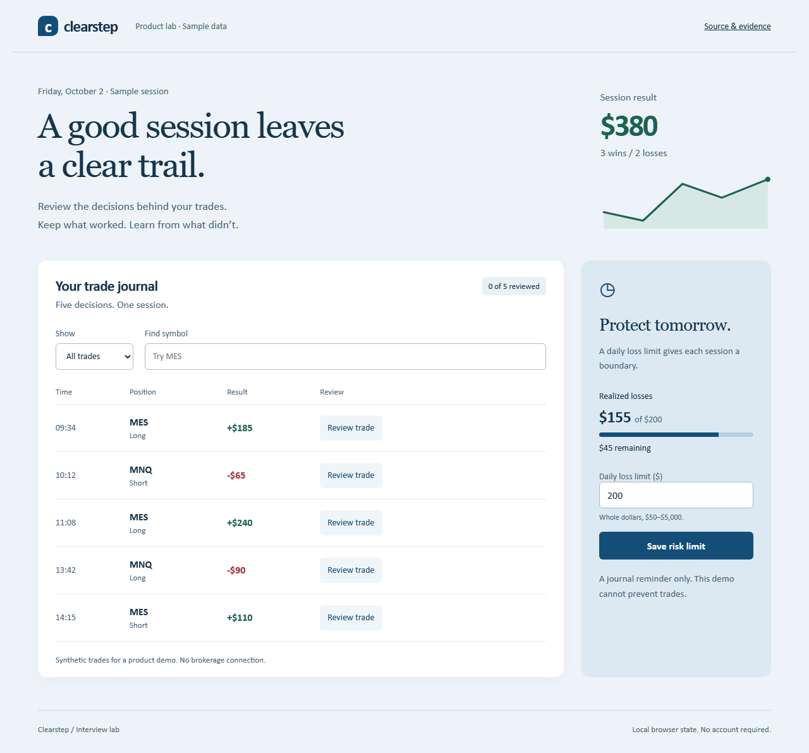

# Design Engineering Product Lab

Turn a session-review brief into an accessible responsive product that works in a browser.

[](https://github.com/afimeth/design-engineering-product-lab/actions)

## Run, test and demo

```sh
npm ci
npm test
npm run build
npm run budget
npx playwright install chromium
npm run test:e2e
npm run dev
python scripts/verify.py
```

Install Python 3.11+ for the evidence harness. Install Node 22.12+ and npm; install dependencies with npm ci. External paid services are not required.

## Implemented

React + TypeScript trading-journal UI with synthetic fixtures, filters/search/empty state, review modal, native focus behavior, validated risk-limit form, local persistence, malformed-storage recovery, responsive layout, Chromium interaction + axe checks, gzip transfer-size budget.

## Evidence and status

- **IMPLEMENTED:** runnable code and failure tests in this repository.
- **MEASURED:** [baseline](evidence/baseline.json) identifies the measured source commit. Each CI matrix job uploads a fresh `receipt.json` for its exact `GITHUB_SHA`, with actual test totals and toolchain. A receipt commit does not rewrite the measured source SHA.
- **DESIGNED:** Brokerage integration, conversion experimentation and manual assistive-technology review remain extensions.
- **NOT CLAIMED:** Synthetic local journal; no brokerage, trading enforcement, backend, auth, financial advice, analytics/conversion uplift, live market data, professional design-tool history, broad browser matrix, manual screen-reader audit or complete WCAG certification. Axe checks cover exercised desktop/modal/mobile states only. Gzip budget is not Core Web Vitals. Unit tests use storage/dialog fixtures; Chromium tests use real browser APIs.

Run `python scripts/verify.py` to regenerate ignored local receipts. Benchmark/gas/bundle reports are local measurements, not a production SLO. CI and local runs are separate evidence. Passing tests are not an independent review or an accepted production release.

## Safe CV claim

> Built a responsive React/TypeScript session journal with stateful review/filtering, validated persisted settings, keyboard/modal checks, automated accessibility checks, and a measured asset-size budget.

This describes a laboratory project. It does not establish years of experience, a degree, production scale, employer history, CVEs, mainnet ownership, or independent audit credentials.

## Design and interview walkthrough

See [architecture](docs/ARCHITECTURE.md), [limitations](docs/LIMITATIONS.md), and [interview scenarios](docs/INTERVIEW_SCENARIOS.md). All inputs are synthetic. This is a fresh AI-assisted standalone implementation from public requirements; no private source, customer data, credentials or proprietary code was copied. MIT license applies to this lab.

## Browser preview



Static deployment: run `npm run build`, then publish only `dist/` to GitHub Pages or Cloudflare Pages. Relative Vite base supports a repository subpath. No secrets or environment variables are needed.
